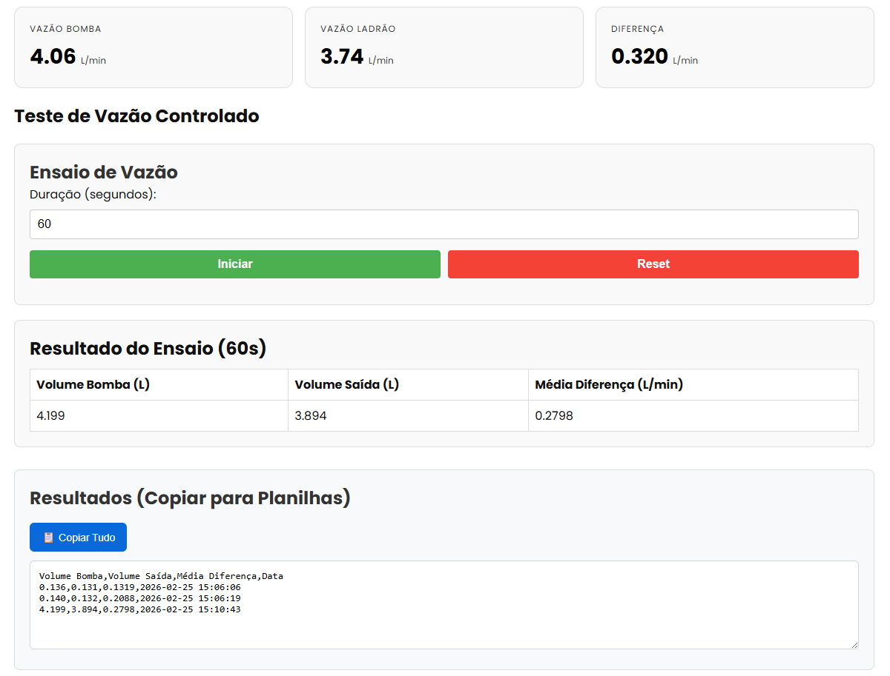

# Monitoramento de Vazão (Realtime)


Projeto web simples para monitorar em tempo real dados enviados por um ESP32-S3-WROOM1 via WebSocket. O ESP envia JSON no formato definido por [`FlowData`](src/types/FlowData.ts). Além disso, foi adicionado um temporizador para a contagem e coleta dos volumes de entrada em n segundos, com o objetivo de coletar esses dados para análises empíricas posteriores.

Principais campos de [`FlowData`](src/types/FlowData.ts):
- `flow1` — vazão da bomba (L/min)
- `flow2` — vazão da saída/extravazor(ladrão) (L/min)
- `diff_raw` — diferença real (flow1 - flow2)
- `diff_abs` — diferença em módulo
- `diff_ma` — diferença com média móvel
- `vol_total` — volume acumulado

### Sistema Hidráulico


Onde está a lógica:
- Conexão e coleta: [`useFlowSocket`](src/hooks/useFlowSocket.ts)  
- UI principal: [src/App.tsx](src/App.tsx) (composição dos componentes abaixo)  
- Componentes:
  - [`Metrics`](src/components/Metrics.tsx) — mostra leituras em tempo real  
  - [`ExperimentControl`](src/components/ExperimentControl.tsx) — controla tempo de ensaio  
  - [`ExperimentResult`](src/components/ExperimentResult.tsx) — mostra resultado do ensaio  
  - [`ExperimentTable`](src/components/ExperimentTable.tsx) — exporta/copía resultados  
- Utilitários: [`numberCSV`](src/utils/numberCSV.ts)

Como iniciar (rápido):
1. Copie e ajuste variáveis:
   - copie [.env.example](.env.example) para `.env` e edite `VITE_WS_URL` (padrão `ws://localhost:81`).
2. Instale dependências:
   ```sh
   npm install
   ```
3. Inicie o servidor:
   ```sh
   npm run dev
   ```

## Capturas de Tela

### Interface Web

